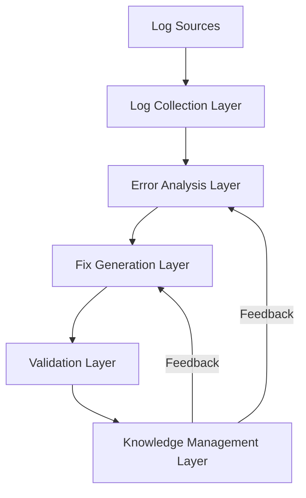
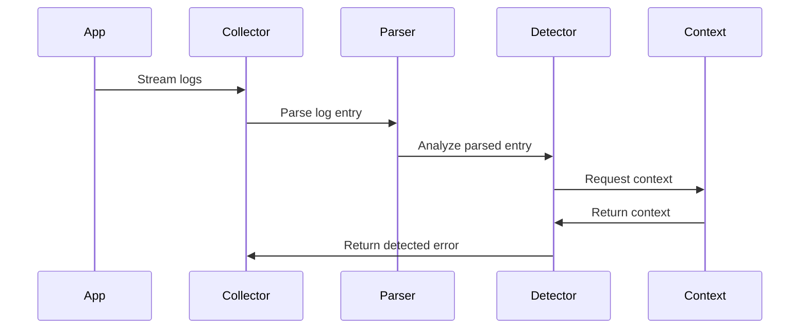
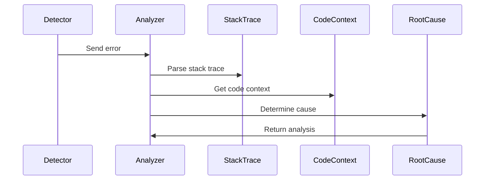
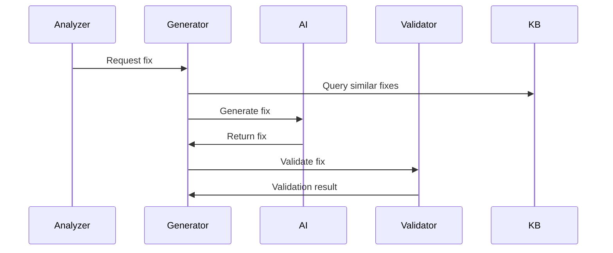
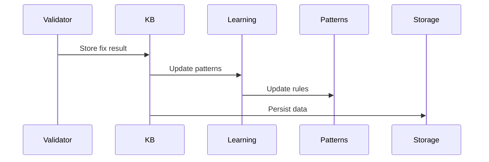
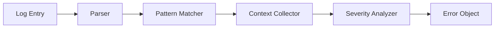
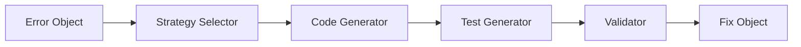
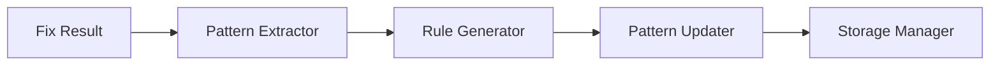

# Hephaestus Flow Documentation

## System Architecture



## Detailed Flow Descriptions

### 1. Log Collection Flow



#### Components:
1. **Log Collector**
   - Handles multiple input sources
   - Manages reader lifecycles
   - Buffers incoming logs

2. **Log Parser**
   - Supports multiple formats
   - Extracts timestamps
   - Normalizes log structure

3. **Error Detector**
   - Pattern matching
   - Severity assessment
   - Context collection

### 2. Error Analysis Flow



#### Components:
1. **Error Analyzer**
   - Classification
   - Pattern recognition
   - Context analysis

2. **Stack Trace Analyzer**
   - Frame parsing
   - Function identification
   - Library detection

3. **Root Cause Analyzer**
   - Pattern matching
   - Historical comparison
   - Context correlation

### 3. Fix Generation Flow



#### Components:
1. **Fix Generator**
   - Strategy selection
   - Code synthesis
   - Fix templating

2. **AI Provider**
   - Model selection
   - Context preparation
   - Response processing

3. **Fix Validator**
   - Syntax checking
   - Test execution
   - Safety validation

### 4. Knowledge Management Flow



#### Components:
1. **Knowledge Base**
   - Error-fix mapping
   - Pattern storage
   - Success metrics

2. **Learning Engine**
   - Pattern extraction
   - Success analysis
   - Rule generation

3. **Storage Manager**
   - Data persistence
   - Backup management
   - Cleanup routines

## Component Interactions

### 1. Error Detection Pipeline



### 2. Fix Generation Pipeline



### 3. Knowledge Management Pipeline



## Data Flow

### 1. Log Entry Flow
```
Raw Log → Parsed Entry → Error Detection → Context Collection → Error Object
```

### 2. Error Analysis Flow
```
Error Object → Classification → Stack Analysis → Context Analysis → Root Cause
```

### 3. Fix Generation Flow
```
Root Cause → Strategy Selection → Code Generation → Validation → Fix Object
```

### 4. Knowledge Update Flow
```
Fix Object → Success Analysis → Pattern Extraction → Rule Update → Storage
```

## State Management

### 1. Client State
- Initialization
- Running
- Paused
- Stopped
- Error

### 2. Monitor State
- Active
- Inactive
- Error
- Reconnecting

### 3. Fix Generation State
- Pending
- Generating
- Validating
- Complete
- Failed

## Error Handling

### 1. Collection Errors
- Reader errors
- Parser errors
- Format errors

### 2. Analysis Errors
- Pattern match failures
- Context collection errors
- Classification errors

### 3. Generation Errors
- AI provider errors
- Validation errors
- Test failures

### 4. Knowledge Base Errors
- Storage errors
- Learning errors
- Pattern update errors

## Performance Considerations

### 1. Log Collection
- Buffer management
- Concurrent readers
- Parser optimization

### 2. Error Analysis
- Pattern matching efficiency
- Context buffer size
- Classification speed

### 3. Fix Generation
- AI request batching
- Validation parallelization
- Resource management

### 4. Knowledge Management
- Storage efficiency
- Learning optimization
- Pattern indexing

## Security Considerations

### 1. Input Validation
- Log source validation
- Pattern validation
- Fix validation

### 2. AI Provider Security
- API key management
- Request/response validation
- Rate limiting

### 3. Knowledge Base Security
- Access control
- Data encryption
- Backup security 