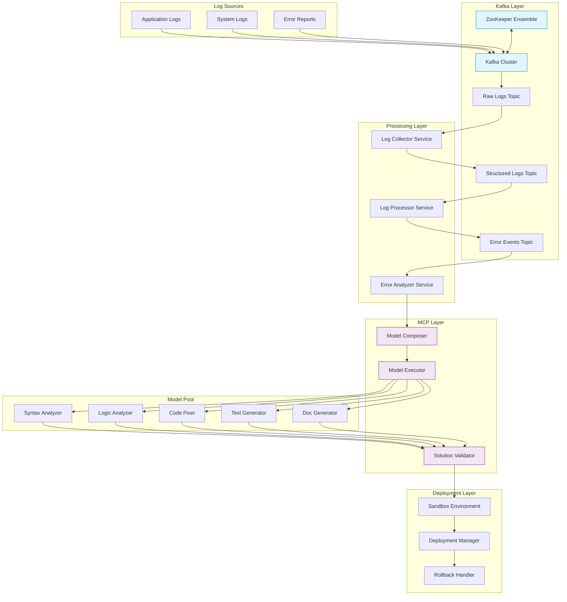
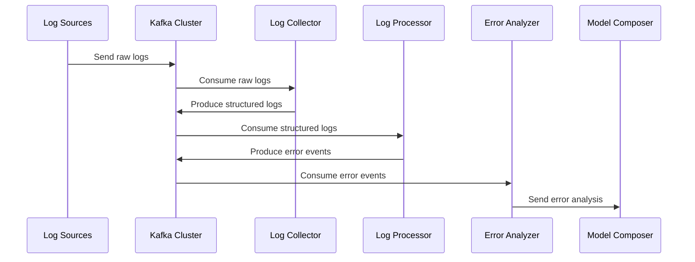
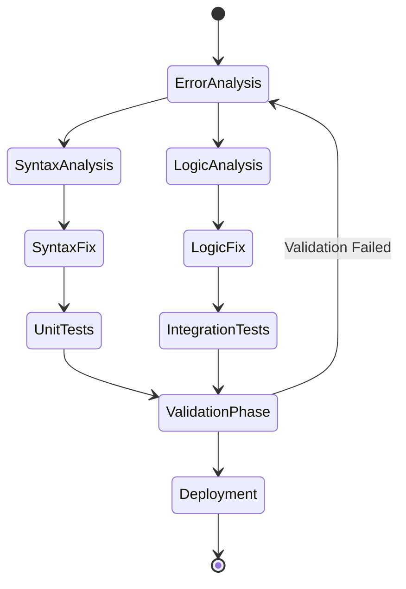
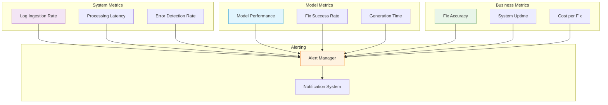

# Hephaestus High-Level Design

## Overall System Architecture



## Log Processing Pipeline



## Model Composition Flow



## Deployment Pipeline

```mermaid
graph LR
    subgraph "Validation"
        V1[Unit Tests]
        V2[Integration Tests]
        V3[Performance Tests]
    end

    subgraph "Sandbox"
        S1[Test Environment]
        S2[Load Testing]
    end

    subgraph "Deployment"
        D1[Staging]
        D2[Production]
        D3[Rollback Handler]
    end

    V1 & V2 & V3 --> S1
    S1 --> S2
    S2 --> D1
    D1 --> D2
    D2 --> D3
    D3 -.-> D1: Rollback if needed

    style V1 fill:#e8f5e9,stroke:#2e7d32
    style V2 fill:#e8f5e9,stroke:#2e7d32
    style V3 fill:#e8f5e9,stroke:#2e7d32
    style D1 fill:#fff3e0,stroke:#ef6c00
    style D2 fill:#fff3e0,stroke:#ef6c00
```

## Monitoring and Metrics



These diagrams provide a visual representation of:
1. Overall system architecture showing all components and their interactions
2. Log processing pipeline sequence
3. Model composition and state transitions
4. Deployment pipeline with validation steps
5. Monitoring and metrics structure

Each component is color-coded for better visualization:
- Blue: Kafka and infrastructure components
- Purple: MCP and model components
- Green: Validation components
- Orange: Deployment components 