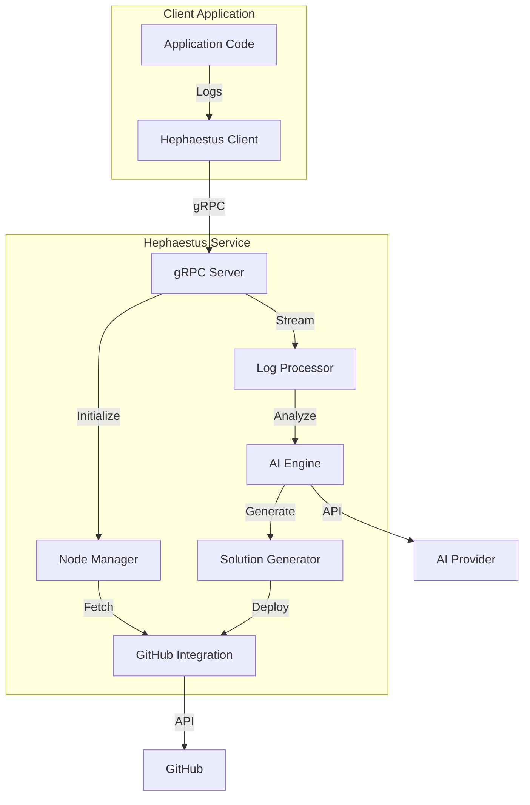
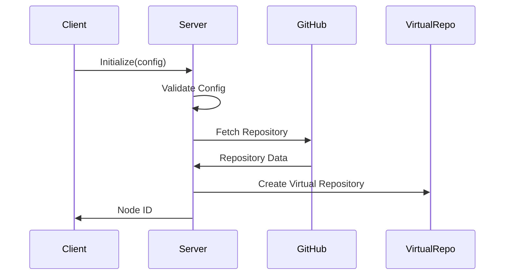
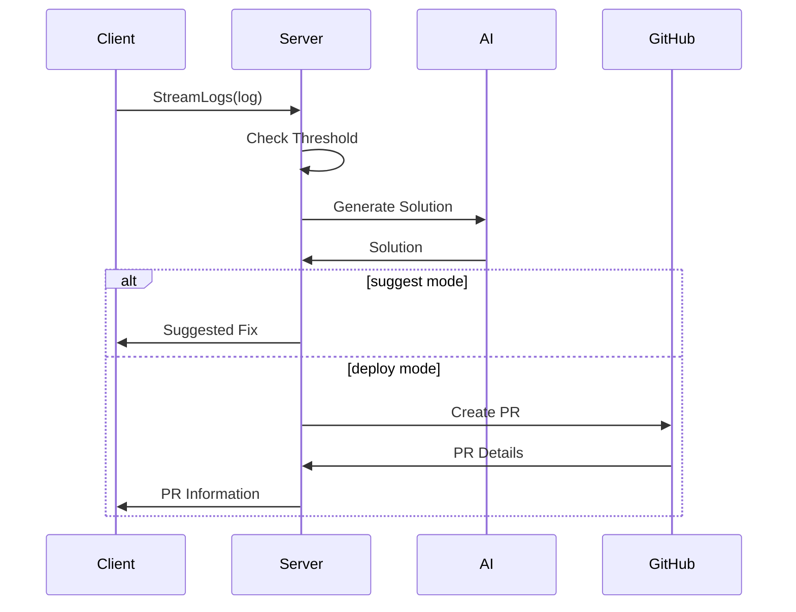

# High-Level Design (HLD)

## Overview

Hephaestus is designed as a distributed system that provides intelligent code analysis and automated fix generation through real-time log monitoring. The system is built with scalability, reliability, and extensibility in mind.

## System Architecture

### Component Diagram

## Core Components

### 1. Node Manager
- Handles node lifecycle (creation, monitoring, cleanup)
- Maintains virtual repository state
- Manages configuration and validation
- Coordinates between components

### 2. Log Processor
- Receives and buffers log streams
- Filters logs based on threshold levels
- Maintains log context for analysis
- Handles backpressure

### 3. Virtual Repository
- In-memory representation of codebase
- File metadata and content caching
- Language-specific parsing
- Dependency tracking

### 4. AI Integration
- Provider abstraction layer
- Context preparation for AI
- Solution validation
- Rate limiting and retry logic

### 5. GitHub Integration
- Repository synchronization
- Pull request management
- Change validation
- Access control

## Data Flow

### 1. Initialization Flow

### 2. Log Processing Flow

## Key Design Decisions

### 1. gRPC Communication
- **Why**: Low latency, bidirectional streaming, strong typing
- **Benefits**:
  - Real-time log processing
  - Efficient binary protocol
  - Language-agnostic API
  - Built-in flow control

### 2. Virtual Repository
- **Why**: Efficient code analysis and context management
- **Benefits**:
  - Reduced GitHub API calls
  - Rich metadata support
  - Fast solution generation
  - Language-specific features

### 3. Streaming Architecture
- **Why**: Real-time processing with backpressure
- **Benefits**:
  - No log loss
  - Resource management
  - Scalable processing
  - Failure isolation

### 4. Mode-based Operation
- **Why**: Flexible deployment options
- **Benefits**:
  - Safe testing (suggest mode)
  - Automated fixes (deploy mode)
  - Environment-specific configuration
  - Progressive adoption

## Scalability Considerations

### 1. Horizontal Scaling
- Multiple server instances
- Load balancing
- Session affinity for streams
- Distributed node management

### 2. Resource Management
- Buffered channels
- Connection pooling
- Cache management
- Rate limiting

### 3. Performance Optimization
- Metadata caching
- Incremental updates
- Batch processing
- Async operations

## Security Considerations

### 1. Authentication
- GitHub token validation
- AI provider authentication
- Client authentication
- Token rotation

### 2. Authorization
- Repository access control
- Operation permissions
- Rate limiting
- Audit logging

### 3. Data Protection
- Token encryption
- Secure communication
- Data sanitization
- Secret management

## Monitoring and Observability

### 1. Metrics
- Node status
- Processing latency
- Success rates
- Resource usage

### 2. Logging
- Operation logs
- Error tracking
- Audit trails
- Performance data

### 3. Alerting
- Node health
- Error rates
- Resource exhaustion
- API limits

## Future Considerations

### 1. Extensibility
- Additional AI providers
- VCS integrations
- Language support
- Custom analyzers

### 2. High Availability
- Node redundancy
- State replication
- Failure recovery
- Zero-downtime updates

### 3. Enterprise Features
- Multi-repository support
- Team management
- Custom rules
- Compliance features 