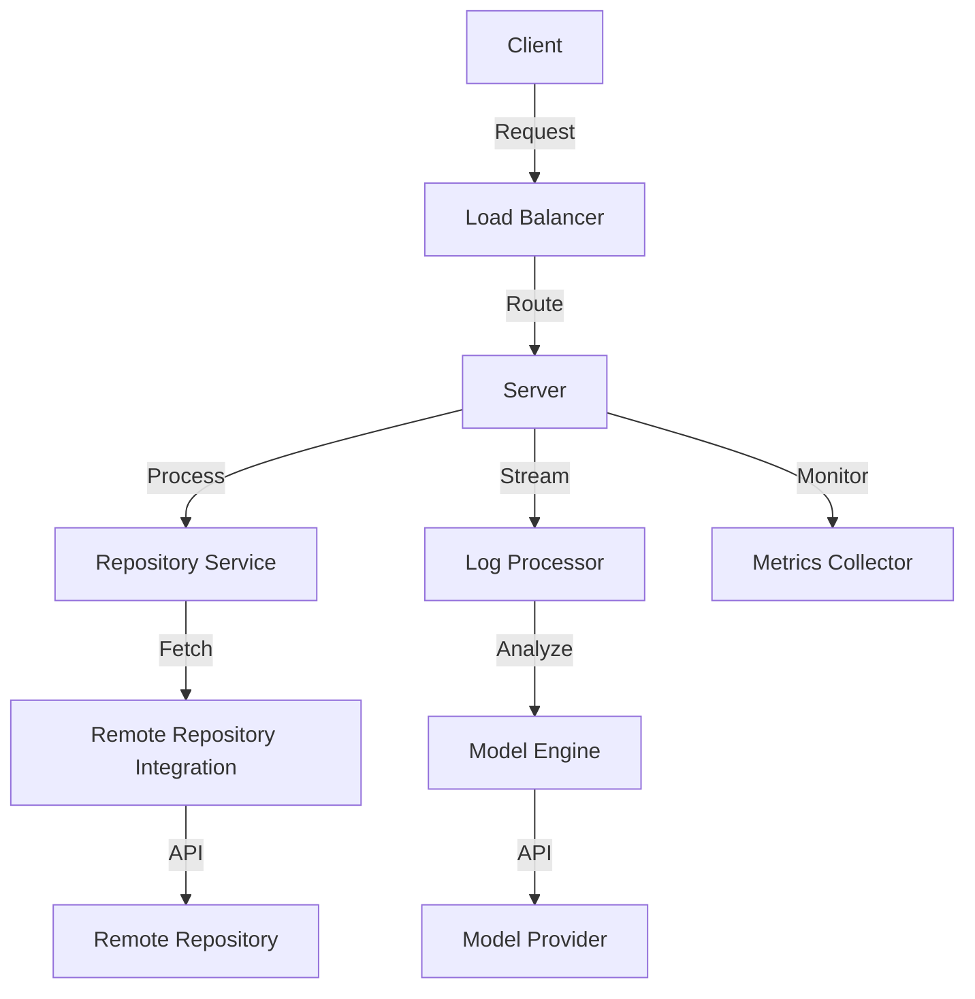
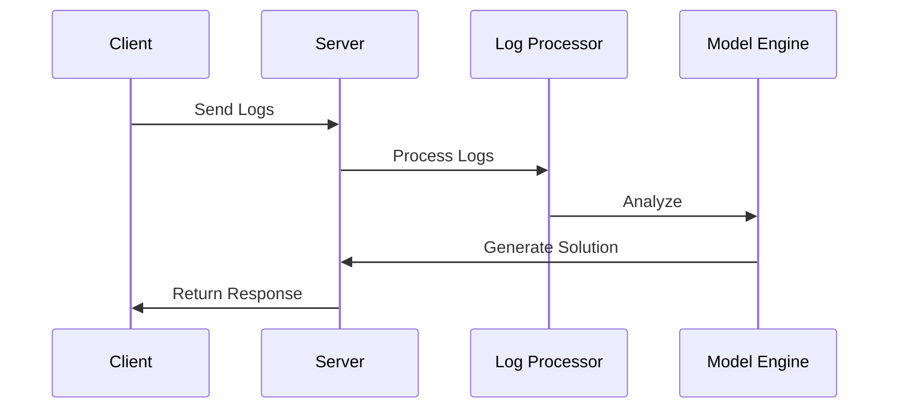
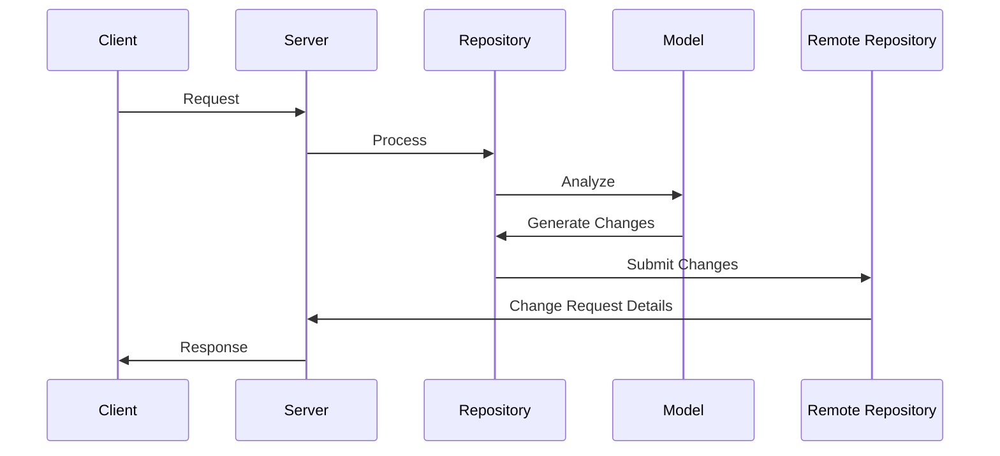

# High-Level Design Document

## System Architecture

The Hephaestus system is designed as a distributed service for monitoring and resolving system issues. Below is the high-level architecture diagram:

## Core Components

### 1. Repository Service
- Manages file operations
- Maintains virtual repository state
- Coordinates with remote repository service
- Handles change request creation

### 2. Log Processor
- Processes incoming log streams
- Filters and categorizes logs
- Maintains log context for analysis
- Routes logs to appropriate handlers

### 3. Node Manager
- Manages node lifecycle
- Tracks node health
- Handles node registration
- Coordinates node operations

### 4. Model Integration
- Processes log data
- Context preparation for model
- Solution generation
- Validation of proposals

### 5. Remote Repository Integration
- Version control system integration
- File operations
- Change request management
- Repository synchronization

## Data Flow

### 1. Log Processing Flow

### 2. Repository Operation Flow

## Performance Considerations

### 1. Caching Strategy
- In-memory caching for frequent operations
- File content caching
- Reduced remote repository API calls
- Cache invalidation policies

### 2. Concurrency
- Parallel log processing
- Concurrent file operations
- Asynchronous model requests
- Connection pooling

### 3. Resource Management
- Connection limits
- Request timeouts
- Rate limiting
- Resource pooling

## Reliability

### 1. Fault Tolerance
- Service redundancy
- Failure isolation
- Graceful degradation
- Retry mechanisms

### 2. Error Handling
- Comprehensive error types
- Error propagation
- Recovery procedures
- Error reporting

### 3. Monitoring
- Health checks
- Performance metrics
- Error rates
- Resource utilization

## Security

### 1. Authentication
- Token-based authentication
- Remote repository authentication
- Model provider authentication
- Node authentication

### 2. Authorization
- Role-based access
- Operation permissions
- Resource access control
- Token validation

### 3. Data Protection
- Secure communication
- Token encryption
- Sensitive data handling
- Audit logging

## Observability

### 1. Logging
- Structured logging
- Log levels
- Context tracking
- Log aggregation

### 2. Metrics
- System metrics
- Business metrics
- Custom metrics
- Metric aggregation

### 3. Tracing
- Request tracing
- Operation tracking
- Performance tracing
- Error tracing

### 4. Monitoring
- System health
- Resource usage
- Error rates
- Audit trails

## Future Considerations

### 1. Extensibility
- Additional providers
- Custom integrations
- Plugin system
- API versioning

### 2. High Availability
- Load balancing
- Service discovery
- Failure recovery
- Data replication

### 3. Scalability
- Horizontal scaling
- Vertical scaling
- Resource optimization
- Performance tuning 