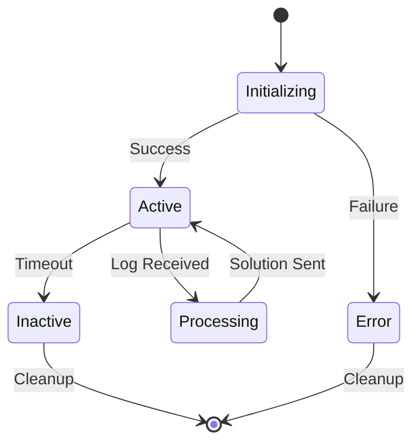

# Low-Level Design (LLD)

## Component Details

### 1. Configuration Management

#### Config Structure
```go
type Config struct {
    GitHub     GitHubConfig
    AI         AIConfig
    Log        LogConfig
    Mode       string
}
```

#### Validation Rules
- Repository format: `owner/repo`
- Valid log levels: debug, info, warn, error
- Valid modes: suggest, deploy
- Required fields: repository, token, api_key
- Default values:
  - Branch: main
  - Log level: info
  - Mode: suggest

### 2. Node Management

#### Node States


#### Node Lifecycle
1. **Creation**
   ```go
   nodeID := uuid.New().String()
   node := &HephaestusNode{
       ID:            nodeID,
       Configuration: config,
       Status:        "active",
       CreatedAt:     time.Now(),
   }
   ```

2. **Monitoring**
   - Health check interval: 30s
   - Inactivity timeout: 1h
   - Resource limits:
     - Max files: 10000
     - Max file size: 1MB
     - Max concurrent streams: 100

3. **Cleanup**
   - Close active streams
   - Release resources
   - Archive logs
   - Remove from node registry

### 3. Virtual Repository

#### File Node Structure
```go
type FileNode struct {
    ID          string
    Path        string
    Content     string
    Language    string
    LastUpdated time.Time
    Metadata    FileMetadata
}

type FileMetadata struct {
    LineCount    int
    Imports      []string
    GitInfo      GitInfo
}
```

#### Repository Operations
1. **Initialization**
   ```go
   repo := &VirtualRepository{
       ID:         repoID,
       GitHubRepo: config.GitHub.Repository,
       Files:      make(map[string]*FileNode),
   }
   ```

2. **File Processing**
   - Language detection
   - Import extraction
   - Metadata collection
   - Content caching

3. **Update Strategy**
   - Incremental updates
   - Change detection
   - Cache invalidation
   - Dependency tracking

### 4. Log Processing

#### Log Entry Structure
```protobuf
message LogEntry {
    string node_id = 1;
    string level = 2;
    string message = 3;
    string timestamp = 4;
    map<string, string> metadata = 5;
    string stack_trace = 6;
}
```

#### Processing Pipeline
1. **Reception**
   ```go
   logChan := make(chan *LogEntry, 100)
   errChan := make(chan error, 1)
   ```

2. **Filtering**
   ```go
   func isLogLevelMet(logLevel, threshold string) bool {
       levels := map[string]int{
           "debug": 0,
           "info":  1,
           "warn":  2,
           "error": 3,
       }
       return levels[logLevel] >= levels[threshold]
   }
   ```

3. **Buffering**
   - Channel size: 100
   - Overflow strategy: Drop
   - Backpressure mechanism
   - Batch processing

### 5. AI Integration

#### Provider Interface
```go
type AIProvider interface {
    GenerateSolution(context.Context, *LogEntry, *VirtualRepository) (*Solution, error)
    ValidateSolution(*Solution) error
    GetCapabilities() AICapabilities
}
```

#### Context Preparation
1. **Code Context**
   - Relevant file content
   - Error location
   - Dependencies
   - Recent changes

2. **Error Context**
   - Stack trace analysis
   - Error pattern matching
   - Historical data
   - Similar issues

3. **Solution Generation**
   - Code analysis
   - Pattern matching
   - Best practices
   - Security checks

### 6. GitHub Integration

#### API Operations
1. **Repository Access**
   ```go
   type GitHubClient struct {
       client *github.Client
       owner  string
       repo   string
   }
   ```

2. **PR Creation**
   ```go
   type PullRequest struct {
       Title     string
       Branch    string
       Changes   []Change
       Reviewers []string
   }
   ```

3. **Change Management**
   - Branch creation
   - File modifications
   - Commit creation
   - PR submission

### 7. Error Handling

#### Error Types
```go
type ValidationError struct {
    Field   string
    Message string
}

type ProcessingError struct {
    Stage   string
    Cause   error
    Context map[string]interface{}
}
```

#### Recovery Strategies
1. **Transient Failures**
   - Retry with backoff
   - Circuit breaker
   - Fallback options
   - Error reporting

2. **Permanent Failures**
   - Graceful degradation
   - User notification
   - Resource cleanup
   - Error logging

### 8. Performance Optimization

#### Caching Strategy
1. **Repository Cache**
   - File content
   - Metadata
   - Analysis results
   - TTL: 1h

2. **Solution Cache**
   - Similar errors
   - Generated fixes
   - Success rate
   - TTL: 24h

#### Resource Limits
```go
const (
    MaxFileSize        = 1 << 20 // 1MB
    MaxFiles           = 10000
    MaxConcurrentLogs  = 100
    MaxSolutionRetries = 3
)
```

### 9. Security Implementation

#### Token Management
```go
type Credentials struct {
    GitHubToken string
    AIToken     string
    Encrypted   bool
}
```

#### Access Control
1. **Repository Level**
   - Read permissions
   - Write permissions
   - PR creation
   - Branch protection

2. **Operation Level**
   - Log submission
   - Solution generation
   - PR creation
   - Configuration updates

### 10. Monitoring Implementation

#### Metrics Collection
```go
type Metrics struct {
    NodeCount       int64
    ActiveStreams   int64
    ProcessedLogs   int64
    GeneratedFixes  int64
    SuccessRate     float64
    ProcessingTime  time.Duration
}
```

#### Health Checks
1. **Component Health**
   - GitHub connectivity
   - AI provider status
   - Stream health
   - Resource usage

2. **System Health**
   - Node status
   - Error rates
   - Response times
   - Resource utilization 