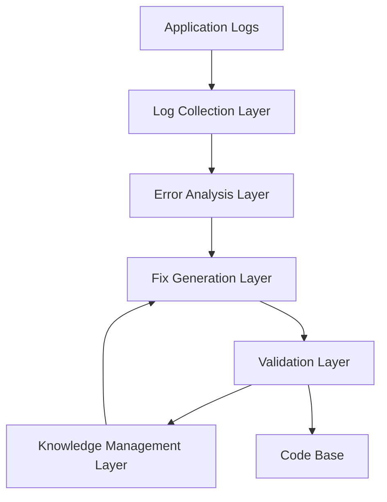
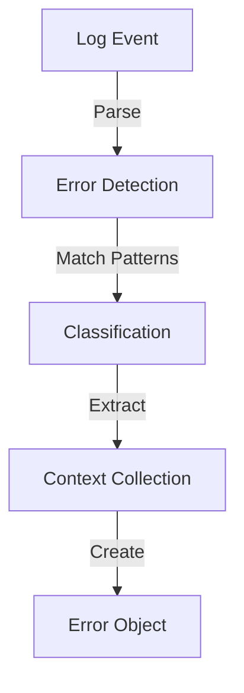
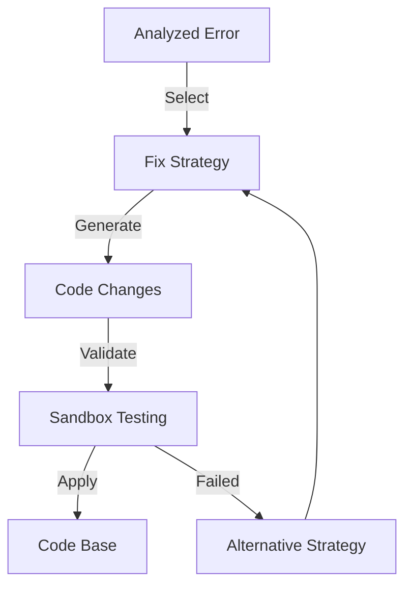
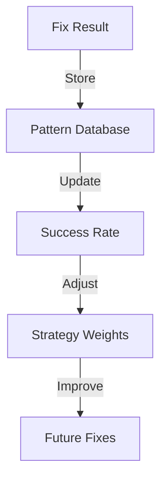

# Hephaestus

[](https://pkg.go.dev/github.com/HoyeonS/hephaestus)
[](https://goreportcard.com/report/github.com/HoyeonS/hephaestus)

Hephaestus is an intelligent error detection and automated fix generation system for Go applications. It monitors application logs in real-time, detects critical issues, and either suggests or automatically applies AI-generated fixes.

## Features

- Real-time log monitoring and error detection
- AI-powered error analysis and fix generation
- Automatic code fixes with sandbox testing
- Knowledge base for learning from past fixes
- Support for multiple AI providers (OpenAI, Anthropic, Google)
- Configurable deployment strategies with rollback support

## High-Level Design

### System Overview

Hephaestus operates as a library that integrates with your Go application, providing real-time error detection and automated fixes. The system follows a pipeline architecture with five main layers:



### Data Flow

1. **Log Collection Flow**:
   ```mermaid
   sequenceDiagram
       participant App as Application
       participant LC as Log Collector
       participant EA as Error Analyzer
       
       App->>LC: Generate logs
       LC->>LC: Monitor log files
       LC->>LC: Detect changes
       LC->>EA: Send error events
   ```

2. **Error Processing Flow**:
   ```mermaid
   sequenceDiagram
       participant EA as Error Analyzer
       participant FG as Fix Generator
       participant KB as Knowledge Base
       
       EA->>EA: Analyze error pattern
       EA->>KB: Query similar errors
       KB->>EA: Return known patterns
       EA->>FG: Send analyzed error
   ```

3. **Fix Generation Flow**:
   ```mermaid
   sequenceDiagram
       participant FG as Fix Generator
       participant AI as AI Model
       participant VS as Validation Service
       participant KB as Knowledge Base
       
       FG->>AI: Request fix generation
       AI->>FG: Return proposed fix
       FG->>VS: Validate fix
       VS->>FG: Return validation result
       FG->>KB: Store successful fix
   ```

## Low-Level Design

### Component Details

1. **Log Collector Service**
   ```go
   type Service struct {
       config     Config        // Configuration settings
       watcher    *fsnotify.Watcher
       errorChan  chan *Error   // Channel for detected errors
       files      map[string]*os.File
       positions  map[string]int64
   }
   ```
   - Monitors log files using `fsnotify`
   - Maintains file positions for incremental reading
   - Uses buffered channels for error propagation
   - Supports multiple log formats and sources

2. **Error Analyzer Service**
   ```go
   type Service struct {
       patterns   []*regexp.Regexp  // Error patterns
       inputChan  chan *Error
       outputChan chan *AnalyzedError
       knowledge  *KnowledgeBase
   }
   ```
   - Pattern-based error classification
   - Stack trace analysis
   - Context extraction
   - Severity assessment

3. **Fix Generator Service**
   ```go
   type Service struct {
       aiClient    AIClient
       strategies  []FixStrategy
       inputChan   chan *AnalyzedError
       outputChan  chan *Fix
   }
   ```
   - AI model integration
   - Strategy-based fix generation
   - Code modification planning
   - Fix validation preparation

4. **Deployment Service**
   ```go
   type Service struct {
       config     Config
       sandbox    *Sandbox
       validator  *Validator
       rollback   *RollbackManager
   }
   ```
   - Sandbox environment management
   - Test execution
   - Rollback handling
   - Deployment orchestration

### Interaction Patterns

1. **Error Detection**:


2. **Fix Generation**:


3. **Knowledge Management**:


### Error Handling

1. **Detection Level**:
   - Log parsing errors
   - File access issues
   - Pattern matching failures

2. **Analysis Level**:
   - Context extraction failures
   - Classification uncertainty
   - Stack trace parsing errors

3. **Generation Level**:
   - AI model errors
   - Strategy selection failures
   - Code generation issues

4. **Deployment Level**:
   - Sandbox creation failures
   - Test execution errors
   - Rollback failures

### Performance Considerations

1. **Concurrency**:
   - Worker pool for error analysis
   - Buffered channels for event handling
   - Mutex-protected shared resources

2. **Resource Management**:
   - File descriptor limits
   - Memory usage monitoring
   - Goroutine lifecycle management

3. **Optimization**:
   - Pattern matching optimization
   - Cache for frequent errors
   - Batch processing where applicable

## Installation

```bash
go get github.com/HoyeonS/hephaestus@v0.1.0
```

## Quick Start

1. Create a configuration file (`config/config.yaml`):

```yaml
collector:
  log_paths:
    - "/var/log/application/*.log"
  polling_interval: "5s"

generator:
  ai_model:
    provider: "openai"
    model: "gpt-4"
    api_key: "${HEPHAESTUS_AI_KEY}"
    fix_mode: "suggest"
```

2. Initialize Hephaestus in your application:

```go
package main

import (
    "github.com/HoyeonS/hephaestus/pkg/hephaestus"
)

func main() {
    config, err := loadConfig("config/config.yaml")
    if err != nil {
        log.Fatal(err)
    }

    client, err := hephaestus.New(config)
    if err != nil {
        log.Fatal(err)
    }

    ctx := context.Background()
    if err := client.Start(ctx); err != nil {
        log.Fatal(err)
    }

    // Handle suggestions
    go func() {
        for suggestion := range client.GetSuggestionChannel() {
            log.Printf("Fix suggestion: %s\n", suggestion.Description)
        }
    }()
}
```

## Configuration

Hephaestus can be configured through a YAML file with the following sections:

- `collector`: Log collection settings
- `analyzer`: Error analysis configuration
- `generator`: Fix generation and AI model settings
- `deployment`: Deployment and validation settings
- `knowledge`: Knowledge base configuration

See [Configuration Guide](docs/configuration.md) for detailed options.

## Architecture

Hephaestus consists of five main components:

1. **Log Collector**: Monitors log files and streams for errors
2. **Error Analyzer**: Analyzes and classifies detected errors
3. **Fix Generator**: Generates code fixes using AI models
4. **Deployment Service**: Tests and applies fixes
5. **Knowledge Base**: Learns from past fixes

## Contributing

We welcome contributions! Please see our [Contributing Guide](CONTRIBUTING.md) for details.

### Development Setup

1. Clone the repository:
```bash
git clone https://github.com/HoyeonS/hephaestus.git
cd hephaestus
```

2. Install dependencies:
```bash
go mod download
```

3. Run tests:
```bash
make test
```

### Code Style

- Follow the [Go Code Review Comments](https://github.com/golang/go/wiki/CodeReviewComments)
- Use `gofmt` for code formatting
- Add comments for exported functions and types
- Write unit tests for new functionality

### Testing

- Write unit tests using the standard `testing` package
- Use table-driven tests where appropriate
- Aim for high test coverage
- Run tests before submitting PRs:
```bash
make test
make lint
```

## Support

- [Documentation](docs/README.md)
- [Issue Tracker](https://github.com/HoyeonS/hephaestus/issues)
- [Discussions](https://github.com/HoyeonS/hephaestus/discussions)
