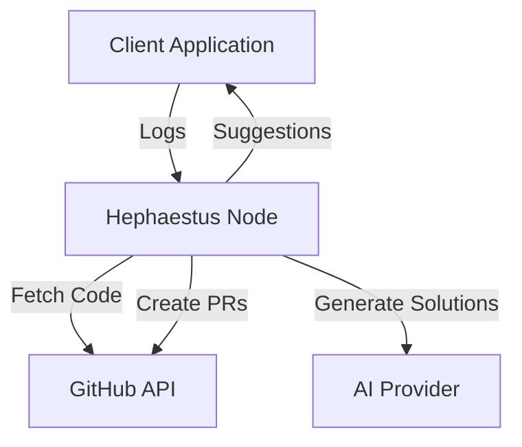

# Hephaestus

Hephaestus is an intelligent code analysis and automated fix generation service that monitors your application logs, analyzes issues, and either suggests fixes or automatically creates pull requests with solutions.

## Features

- **Intelligent Log Analysis**: Real-time monitoring and analysis of application logs
- **AI-Powered Fix Generation**: Leverages AI models (e.g., OpenAI's GPT-4) to generate contextual fixes
- **GitHub Integration**: Seamless integration with GitHub repositories
- **Flexible Deployment Modes**:
  - `suggest`: Returns suggested fixes without making changes
  - `deploy`: Automatically creates pull requests with fixes
- **Real-time Log Streaming**: Bidirectional gRPC streaming for instant log processing
- **Smart Codebase Analysis**: Maintains a virtual repository with rich metadata
- **Configurable Thresholds**: Set log levels that trigger analysis
- **Language Agnostic**: Works with any programming language

## Architecture

### High-Level Overview



### Components

1. **Client**: Sends logs to Hephaestus node
2. **Node**: Manages the lifecycle of log processing and solution generation
3. **Virtual Repository**: In-memory representation of the codebase
4. **AI Integration**: Interfaces with AI providers for solution generation
5. **GitHub Integration**: Handles repository operations and PR creation

## Getting Started

### Prerequisites

- Go 1.21 or later
- GitHub account and personal access token
- AI provider API key (currently supports OpenAI)
- Protocol Buffer compiler (protoc)
- gRPC tools

### Installation

1. Clone the repository:
   ```bash
   git clone https://github.com/HoyeonS/hephaestus.git
   cd hephaestus
   ```

2. Install dependencies:
   ```bash
   go mod download
   ```

3. Generate Protocol Buffer code:
   ```bash
   make proto
   ```

4. Build the project:
   ```bash
   make build
   ```

### Running the Server

1. Start the Hephaestus server:
   ```bash
   ./bin/hephaestus-server --port 50051
   ```

### Using the Client

1. Create a configuration file `config.json`:
   ```json
   {
     "github": {
       "repository": "owner/repo",
       "branch": "main",
       "token": "your-github-token"
     },
     "ai": {
       "provider": "openai",
       "api_key": "your-api-key",
       "model": "gpt-4"
     },
     "log": {
       "level": "info",
       "threshold_level": "error"
     },
     "mode": "suggest"
   }
   ```

2. Run the example client:
   ```bash
   ./bin/hephaestus-client \
     --addr localhost:50051 \
     --repo owner/repo \
     --token your-github-token \
     --ai-key your-api-key \
     --mode suggest
   ```

## Configuration

### GitHub Configuration
- `repository`: GitHub repository in format "owner/repo"
- `branch`: Target branch (defaults to "main")
- `token`: GitHub personal access token with repo scope

### AI Configuration
- `provider`: AI provider name (e.g., "openai")
- `api_key`: API key for the AI provider
- `model`: Model to use (e.g., "gpt-4")

### Log Configuration
- `level`: General logging level ("debug", "info", "warn", "error")
- `threshold_level`: Minimum level to trigger analysis

### Mode
- `suggest`: Only return suggested fixes
- `deploy`: Automatically create pull requests

## API Reference

Hephaestus uses gRPC for communication. The main service methods are:

1. `Initialize`: Creates a new Hephaestus node
2. `StreamLogs`: Establishes bidirectional streaming for logs and solutions
3. `GetNode`: Retrieves node information

See [proto/hephaestus.proto](proto/hephaestus.proto) for the complete API specification.

## Development

### Project Structure

```
hephaestus/
├── cmd/                    # Command-line applications
│   ├── server/            # Server implementation
│   └── client/            # Client implementation
├── internal/              # Internal packages
│   ├── ai/               # AI provider integration
│   ├── github/           # GitHub integration
│   └── server/           # Server core logic
├── pkg/                   # Public packages
│   └── hephaestus/       # Main package
├── proto/                 # Protocol Buffers
└── examples/             # Example implementations
```

### Building from Source

```bash
# Generate Protocol Buffer code
make proto

# Run tests
make test

# Build binaries
make build

# Clean build artifacts
make clean
```

## Contributing

Please read our [Contributing Guidelines](CONTRIBUTING.md) for details on our code of conduct and the process for submitting pull requests.

## Documentation

- [High-Level Design](docs/HLD.md)
- [Low-Level Design](docs/LLD.md)
- [API Documentation](docs/API.md)
- [Development Guide](docs/DEVELOPMENT.md)

## License

This project is licensed under the MIT License - see the [LICENSE](LICENSE) file for details.

## Support

For support, please:
1. Check the [documentation](docs/)
2. Search existing [issues](https://github.com/HoyeonS/hephaestus/issues)
3. Create a new issue if needed

## Acknowledgments

- OpenAI for GPT models
- GitHub for repository integration
- The Go team for gRPC support 